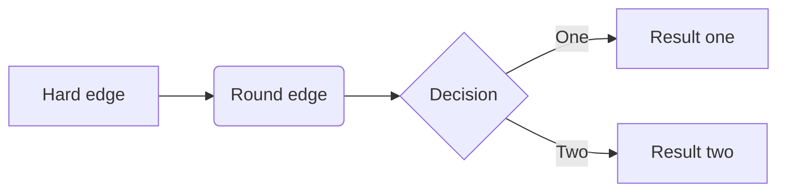
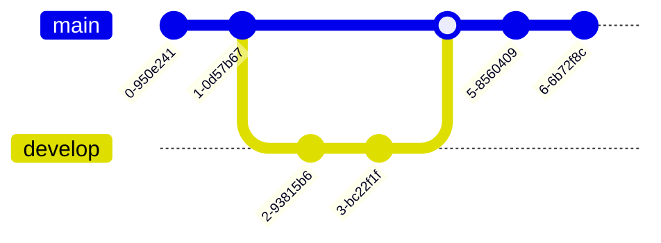
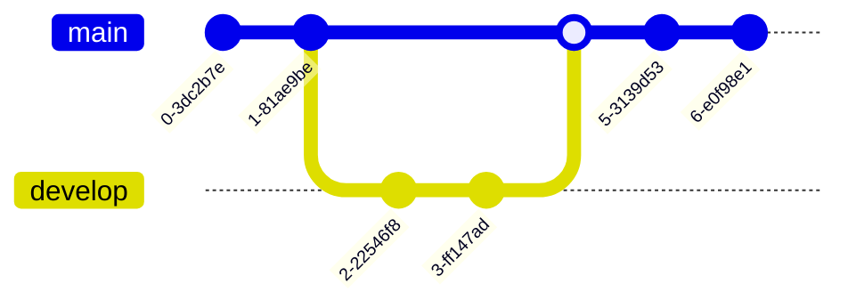

<https://support.typora.io/Draw-Diagrams-With-Markdown/>  

```mermaid
graph LR
A[Hard edge] -->B(Round edge)
    B --> C{Decision}
    C -->|One| D[Result one]
    C -->|Two| E[Result two]
```
---  
<https://mermaid.js.org/syntax/gitgraph.html>  
---  

```mermaid
gitGraph
       commit
       commit
       branch develop
       checkout develop
       commit
       commit
       checkout main
       merge develop
       commit
       commit
```

---  
title: Example Git diagram  
---  

```mermaid
gitGraph
   commit
   commit
   branch develop
   checkout develop
   commit
   commit
   checkout main
   merge develop
   commit
   commit
```
