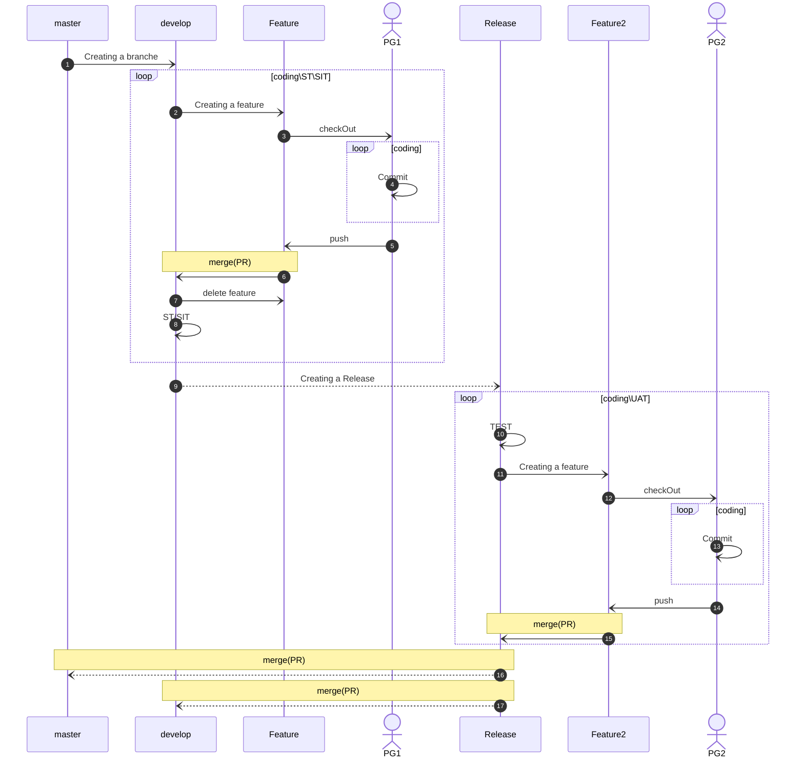

A successful Git branching model  
https://nvie.com/posts/a-successful-git-branching-model/  

https://mermaid.js.org/syntax/sequenceDiagram.html  

```mermaid

 sequenceDiagram
    autonumber
    participant  master
    participant  develop
    participant  Feature
    actor PG1
    participant  Release
    participant  Feature2
    actor PG2

    master -) develop:Creating a branche
    loop coding\ST\SIT
    develop -)Feature: Creating a feature  
    Feature -)PG1: checkOut
    loop coding
    PG1 -)PG1: Commit
    end
    PG1 -) Feature:push 
    Note over develop,Feature:merge(PR)     
    Feature -)develop:  
    develop -)Feature: delete feature  
    develop-)develop: ST/SIT  
    end     
    develop--)Release: Creating a Release
   loop coding\UAT 
    Release -)Release: TEST
    Release -)Feature2: Creating a feature  
    Feature2 -)PG2: checkOut
    loop coding
    PG2 -)PG2: Commit
    end
    PG2 -) Feature2:push 
    Note over Release,Feature2:merge(PR) 
    Feature2 -) Release: 
    end
    Note over Release,master:merge(PR) 
    Release --)master: 
    Note over Release,develop:merge(PR) 
    Release --)develop : 

``` 