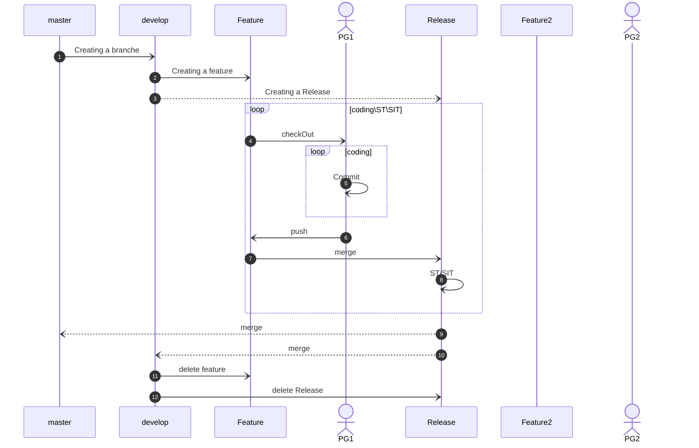

#版本1  
 

```mermaid

 sequenceDiagram
    autonumber
    participant  master
    participant  develop
    participant  Feature
    actor PG1
    participant  Release
    participant  Feature2
    actor PG2

    master -) develop:Creating a branche

    develop -)Feature: Creating a feature  
    develop--)Release: Creating a Release
    loop coding\ST\SIT
    Feature -)PG1: checkOut
    loop coding
    PG1 -)PG1: Commit
    end
    PG1 -) Feature:push 
    Feature -)Release: merge

    Release-)Release: ST/SIT  
    end     
    Release --)master: merge 
    Release --)develop : merge 
    develop -)Feature: delete feature  
    develop -)Release: delete Release  
```