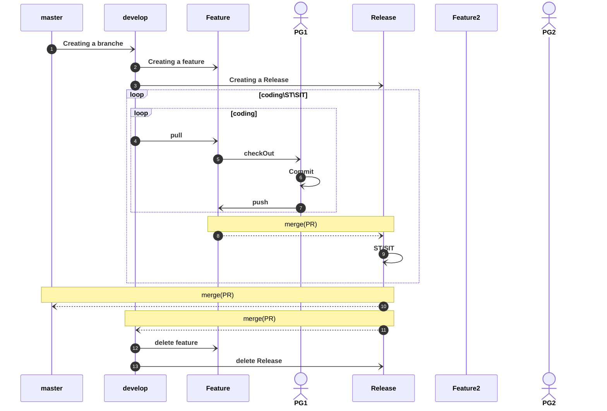

#版本1  
 

```mermaid
 %%{
  init: {
    "sequence": {
      "actorFontFamily": "monospace",
      "actorFontWeight": "bold",
      "messageFontFamily": "monospace",
      "messageFontWeight": "bold",
      "noteFontWeight": "bolder"
    }
  }
}%%
 sequenceDiagram
    autonumber
    participant  master
    participant  develop
    participant  Feature
    actor PG1
    participant  Release
    participant  Feature2
    actor PG2

    master -) develop:Creating a branche

    develop -)Feature: Creating a feature  
    develop -)Release: Creating a Release
    loop coding\ST\SIT
        loop coding
          develop -)Feature: pull
          Feature -)PG1:  checkOut   
          PG1 -)PG1: Commit
          PG1 -) Feature:push 
        end
      Note over Release,Feature:merge(PR) 
      Feature --) Release: 
      Release-)Release: ST/SIT  
    end     
    Note over Release,master:merge(PR) 
    Release --)master:  
    Note over Release,develop:merge(PR)     
    Release --)develop :  
    develop -)Feature: delete feature  
    develop -)Release: delete Release  
```