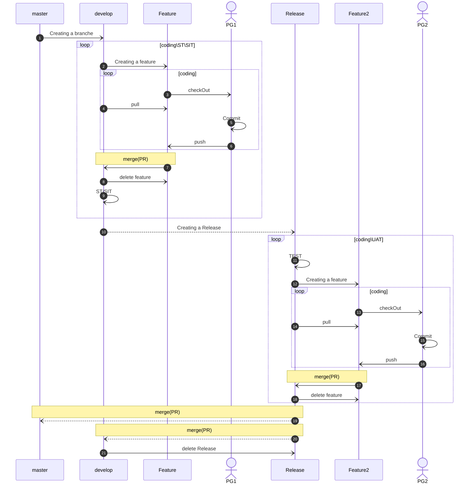

#版本2  

```mermaid

 sequenceDiagram
    autonumber
    participant  master
    participant  develop
    participant  Feature
    actor PG1
    participant  Release
    participant  Feature2
    actor PG2

    master -) develop:Creating a branche
    loop coding\ST\SIT
        develop -)Feature: Creating a feature  
        loop coding
            Feature -)PG1: checkOut    
            develop -)Feature: pull 
            PG1 -)PG1: Commit
            PG1 -) Feature:push 
        end

        Note over develop,Feature:merge(PR)     
        Feature -)develop:  
        develop -)Feature: delete feature  
        develop-)develop: ST/SIT  
    end     
    develop--)Release: Creating a Release
   loop coding\UAT 
        Release -)Release: TEST
        Release -)Feature2: Creating a feature  

        loop coding
            Feature2 -)PG2: checkOut
            Release -)Feature2: pull     
            PG2 -)PG2: Commit
            PG2 -) Feature2:push 
        end

        Note over Release,Feature2:merge(PR) 
        Feature2 -) Release: 
        Release -)Feature2: delete feature  
    end
    Note over Release,master:merge(PR) 
    Release --)master: 
    Note over Release,develop:merge(PR) 
    Release --)develop : 
    develop -)Release: delete Release  
```